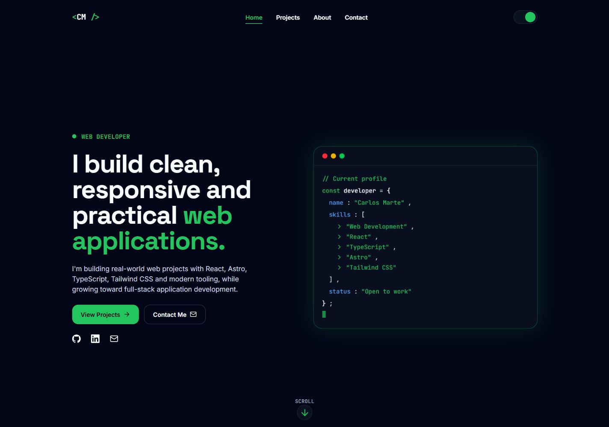
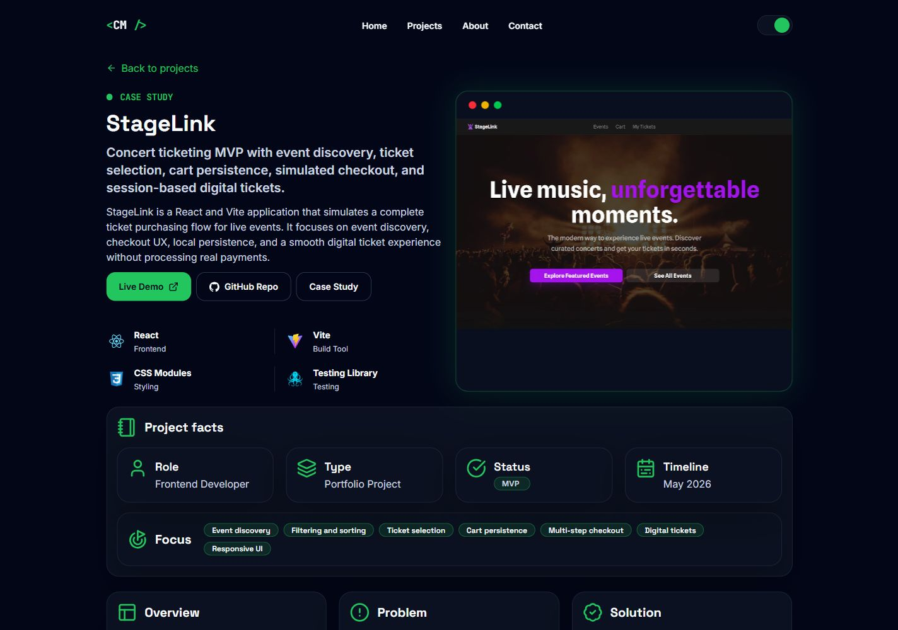
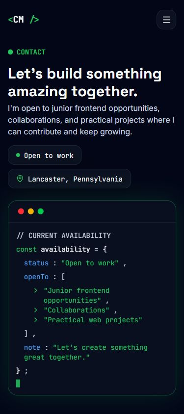

# Carlos Marte Portfolio

Personal portfolio for Carlos Marte, a web developer focused on building clean, responsive, and practical web applications.

[Live site](https://carlosmarte.dev) | [Featured project: StageLink](https://stagelink.carlosmarte.dev/) | [About this site](https://carlosmarte.dev/about-this-site/) | [Contact](https://carlosmarte.dev/contact/)

## Status

Version: `0.3.0`

This project has moved past the initial setup phase. The current version includes the public portfolio foundation, custom domain setup, responsive pages, project case study content, SEO metadata, and a clearer content structure that can later receive data from local files, JSON, an API, or a CMS.

The portfolio is still pre-MVP. The main remaining work is to finish public-facing polish, add more project depth, and validate the final content before treating the first portfolio release as complete.

## Screenshots

### Homepage



### StageLink case study



### Contact page on mobile



## What is included

- Astro site deployed at `https://carlosmarte.dev`.
- Responsive homepage, about page, contact page, and project case study route.
- StageLink project case study with live demo, GitHub link, gallery, project facts, tech stack, and product narrative.
- About This Site page planned as a portfolio case study for the portfolio itself.
- Shared site, navigation, page, project, skill, and contact data modules.
- Dark and light theme support.
- Custom textual brand mark and simplified favicon.
- Canonical domain, sitemap integration, robots file, Open Graph metadata, Twitter metadata, and structured data.
- Local image assets for profile, social preview, project gallery, and README screenshots.

## Tech stack

- [Astro](https://astro.build/)
- [Tailwind CSS v4](https://tailwindcss.com/)
- [React](https://react.dev/)
- [TypeScript](https://www.typescriptlang.org/)
- [@astrojs/sitemap](https://docs.astro.build/en/guides/integrations-guide/sitemap/)
- [astro-icon](https://www.astroicon.dev/)
- [Fontsource](https://fontsource.org/)

## Featured project

StageLink is the first featured case study in the portfolio. It is a React and Vite concert ticketing MVP with event discovery, filtering and sorting, ticket selection, cart persistence, simulated checkout, and session-based digital tickets.

- [Live demo](https://stagelink.carlosmarte.dev/)
- [GitHub repo](https://github.com/carlosmarte23/stagelink)
- [Portfolio case study](https://carlosmarte.dev/projects/stagelink/)

## Portfolio showcase

The `About This Site` page is intended to become a second MVP showcase: a case study for this portfolio itself. It should explain the design direction, Astro architecture, content structure, SEO setup, responsive decisions, and deployment work behind `carlosmarte.dev`.

- [About this site](https://carlosmarte.dev/about-this-site/)
- Showcase focus: portfolio strategy, content architecture, technical SEO, responsive UI, and public deployment.

## Project structure

```text
src/
  components/
    about/
    contact/
    home/
    layout/
    projects/
    shared/
    skills/
    ui/
  data/
    pages/
    contact.ts
    navigation.ts
    projects.ts
    site.ts
    skills.ts
    socialLinks.ts
  layouts/
    BaseLayout.astro
  pages/
    about.astro
    about-this-site.astro
    contact.astro
    index.astro
    projects/
      [slug].astro
  styles/
    global.css
  types/
    content.ts

public/
  images/
    og/
    profile/
    projects/
    readme/
  favicon.ico
  favicon.svg
  robots.txt
```

## Local development

Requirements:

- Node.js `>=22.12.0`
- pnpm `10.33.0`

Install dependencies:

```bash
pnpm install
```

Start the development server:

```bash
pnpm dev
```

Run Astro and TypeScript checks:

```bash
pnpm check
```

Build for production:

```bash
pnpm build
```

Preview the production build:

```bash
pnpm preview
```

## MVP checklist

Done:

- Public custom domain configured.
- Portfolio brand, favicon, and shared navigation updated.
- Core pages created: home, about, contact, and project detail.
- StageLink case study published with live demo and gallery assets.
- About This Site route created as the foundation for a portfolio self-case-study.
- Content data split into page/context modules with shared TypeScript types.
- SEO baseline added with canonical URLs, sitemap, robots, Open Graph, Twitter metadata, and structured data.

Remaining before the first MVP release:

- Final copy review across public pages.
- Add or expand project case studies beyond StageLink.
- Expand About This Site into a complete portfolio showcase for the MVP.
- Review mobile spacing and visual consistency one more time.
- Confirm contact flow and public social links.
- Run final production build and browser review before release.

## Goal

The first MVP should make it immediately clear who Carlos is, what he builds, which projects best represent his current skill level, and how to contact him for frontend work or collaboration.
